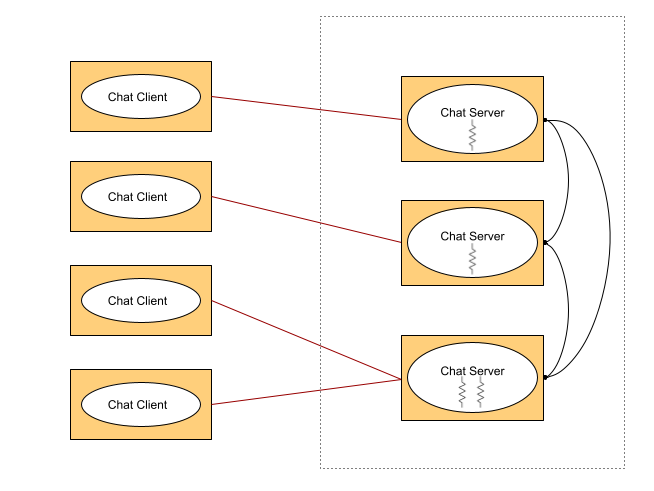

# Distributed Chat Application

## Technology Stack

The system consists of two main distributed components: chat servers and chat clients, which can run on different hosts. The architecture of the system is presented below:

Chat clients are programs that can connect to at most one chat server; which can be any of the available servers. Chat clients can be used to send requests for creating, deleting, joining and quitting a chat room. They can also be used to send requests to see the list of available chat rooms in the system and the list of client identities currently connected to a given chat room. Finally, they can be used to send chat messages to other chat clients connected to the same chat room.

Chat servers are programs accepting multiple incoming TCP connections from chat clients. There are multiple servers working together to serve chat clients. The number of servers is fixed and does not change once the system is active. Each server is responsible for managing a subset of the system's chat rooms. In particular, a server manages only those chat rooms that were created locally after receiving a request from a client. In order to join a particular chat room, clients must be connected to the server managing that chat room. As a result, clients are redirected between servers when a client wants to join a chat room managed by a different server. Chat servers are also responsible for broadcasting messages received from clients to all other clients connected to the same chat room.
## Chat Client
A chat client is executed as follows:

java -jar client.jar -h server_address [-p server_port] -i identity [-d]
Square brackets ([]) are used to indicate optional arguments.

- server_address corresponds to the ip address or hostname of the server to which the client is connecting to.

- server_port corresponds to the port in which the server is listening for incoming client connections.

- The default server_port is 4444.

- identity corresponds to the client's identity (i.e. username) which must be unique in the entire system. If the identity already exists, the server will send a message to the client indicating the error and will then close the connection. If the identity doesn't exist, a connection is established and the server places the client on its MainHall chat room.

- The -d option can be used to start the client in debug mode. This means that all the received and sent messages will be printed on the standard output.

The client user interface is command-line based and reads input from the standard input. Each line of input is terminated by a new line and is interpreted by the client as either a command or a message. If the line of input starts with a hash character "#" then it is interpreted as a command, otherwise it is interpreted as a message that should be broadcasted by the chat server to other clients in the same chat room. The list of commands supported by chat clients is as follows:

    #list
    #who
    #createroom roomid
    #joinroom roomid
    #deleteroom roomid
    #quit
Pressing Ctrl-C terminate chat clients and works similar to #quit.

Here is an example of how a client session may look:

    E:\>java -jar client.jar -h localhost -p 4444 -i Adel
    Adel moves to MainHall-s1
    [MainHall-s1] Adel> #createroom comp90015
    [MainHall-s1] Adel> Room comp90015 is created.
    [MainHall-s1] Adel> Adel moves from MainHall-s1 to comp90015
    [comp90015] Adel> Maria moves from MainHall-s1 to comp90015
    [comp90015] Adel> We have a new comer to the room, Hi Maria!
    [comp90015] Adel> Maria: Hi everybody!
    [comp90015] Adel> Maria: Bye
    [comp90015] Adel> Maria moves from comp90015 to MainHall-s1
    [comp90015] Adel> #deleteroom comp90015
    [comp90015] Adel> Room comp90015 is deleted.
    [comp90015] Adel> Adel moves from comp90015 to MainHall-s1
    [MainHall-s1] Adel> Maria moves from MainHall-s1 to jokes
    [MainHall-s1] Adel> #quit
    [MainHall-s1] Adel> Adel quits
A client may receive messages at any time, and these will be written to the standard output as soon as they are received, even if the client is in the middle of typing a message.

## Chat Server
A chat server listens for incoming connection requests from clients. It is capable of accepting and managing multiple client connections simultaneously.

A chat server stores data in memory

- A list of all the existing chat rooms in the system, including those managed by other servers.
- A list of all the client identities currently connected to that server.

Communications in a chat server can be categorized into two main groups: Communication with chat clients and Communication with other chat servers.

## Communication with chat clients

A chat server is primarily responsible for managing all the clients currently connected to it and for broadcasting chat messages. To achieve this, TCP connections between clients and servers are established and remain active throughout the duration of the client-server interaction. That is, the connection is only closed when:

- The identity of the client already exists,
- The client quits the system,
- The client program is abruptly terminated (e.g. using Ctrl-C),
- The client is redirected to a different server.

It is the responsibility of the server to remove the identity of an existing client, the client's chat room (if any), associated thread(s), the TCP connection with client (if any), after sending the appropriate protocol message to the client (if required).

## Communications among chat servers

To maintain consistency among servers' data, such as ensuring the global uniqueness of client identities and chat rooms, servers may need to communicate with each other to reach consensus.

Servers communicate with each other using GRPC.

## Chat Rooms

A chat room is a place in which clients can exchange chat messages. Each server initially has a chat room called MainHall-serverid (e.g.: s1 server has MainHall-s1). When a client initially connects to a server, it is placed in the **MainHall **chat room of that server.

The following rules regarding chat rooms must be enforced by a chat server:

- Name of the chatroom (roomid) is unique among all the servers.
- Each client is only allowed to be a member of one chat room at a time.
- It is the chat server's job to broadcast messages to all the chat clients in a room.
- Clients who are members of a chat room must be connected to the server managing that chat room.
- If a client creates a chat room, then that chat room will be managed by the server that the client is connected to.
- A chat client is able to own only one chat room at a time.
- Each server must maintain a list of globally available chat rooms and a list of its locally managed chat rooms.
- If a client joins a room managed by the server it is connected to, then the server simply places the client in the corresponding room. If the room is managed by another server, then the server sends a message to the client redirecting it to the server managing that chat room.
- Only the owner of a chat room (i.e., the client that created the chat room) can delete a chat room.
- If a client deletes a chat room, the members of the room are moved to the MainHall of the server. The server will send a message to all the corresponding clients informing them they have changed rooms.
- A chat room is deleted if the owner client quits or disconnects abruptly. The remaining members of the chat room are moved into the MainHall of the server.

## JSON Format
All communication in the system takes place by exchanging messages encapsulated in JSON format.
- All messages will be sent as JSON objects with a newline ("\n") to delimit objects.
- A JSON library must be used to marshal and unmarshal JSON objects.
- All data written to the TCP connection must be UTF8 encoded.

## Executing a chat server

Chat servers should take the following inputs from the command line:

- serverid is the name of the server,
- servers_conf is the path to a text file containing the configuration of servers.

Each line of the configuration file contains the following "tab" delimited data without a header:

serverid	server_address	clients_port	coordination_port

- serverid is the name of the server,
- server_address is the ip address or hostname of the server,
- clients_port is the port used to communicate with clients,
- coordination_port is the port used by the server to communicate with other servers

A sample configuration file looks like:

s1 localhost	4444	5555
s2	localhost	4445	5556
s3 	192.168.1.2     4444	5000

- Each server will find its own configuration in the configuration file using serverid.
- Use command line argument parsing.
- Clients can connect to servers only after all the servers have been started.
